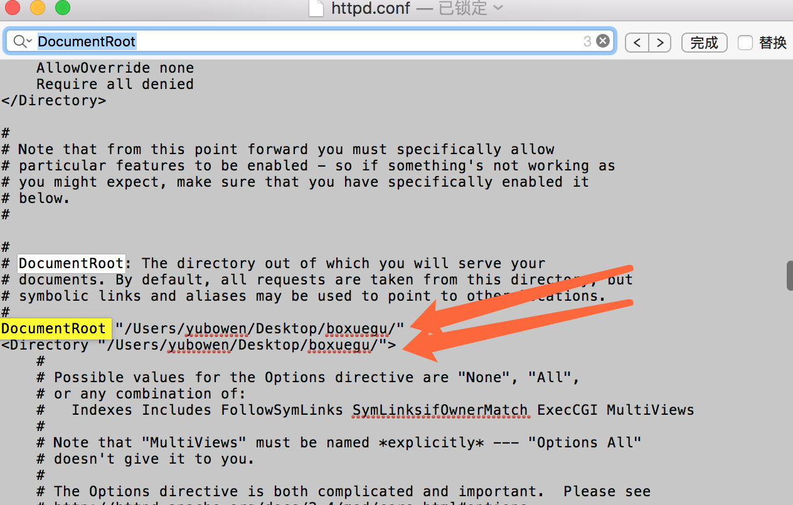

# 关于 Mac 自带的Apache如何开启

--
首先我要说的就是，其实 &nbsp;&nbsp;&nbsp; **Mac自带的 Apache 是默认开启的!!**

### 本文主要讲述 mac 如何开启自带的Apache 服务器以及过程中出现的一个小问题

看本文您需要会基本的 shell 知识

我电脑的基本信息：

- 电脑购买时期：MacBook Pro (Retina, 13-inch, Early 2015)（128G的乞丐版）
- 系统版本：10.12.3   MacOS Sierra

在网上看了好多的教程，都是大同小异，并没有从根本上解决我的问题

在此自己写个文档

## 第一步，启动服务器

- 查看电脑Apache的版本和php的版本

```javascript
sudo apachectl -v
php -v
```


全都是以下这种方式

```javascript
sudo apachectl start
```

然后就说什么Apache服务器就启动了什么的

- 运行上面的代码之后如下图所示，显示的这个东西


打印这个东西

```javascript

/System/Library/LaunchDaemons/org.apache.httpd.plist: service already loaded


```

意思就是 服务器已经加载

但是当我在浏览器输入 http://127.0.0.1  或者 http://localhost  的时候，发现总是提示“无法连接到服务器”。在网上找了很多的方法，全都不起作用，最后用此办法解决了该问题。

解决方法：

1. 在log目录下，新建一个名为apache2的文件夹（终端：$ sudo mkdir /private/var/log/apache2）


2. 然后重启apache（终端：$ sudo apachectl restart） 


这样会自动在apache2里面重新生成apache需要的日志，便可正常访问和使用apache服务了。

## 第二步，更改默认的文件路径位置

默认的位置是    /Library/WebServer/Documents

比如我想将其改到桌面上

- 点击“前往”，点击“前往文件夹”，然后输入以下路径并回车


- 在其中找到 Apache2 的文件夹，打开之后找到以下文件


由于mac的权限问题，所以需要将这个文件拖到桌面上，打开进行编辑

将此处的路径改成自己想要的路径



然后重启服务器

```javascript
sudo apachectl restart
```

然后打开 127.0.0.1 就可以看到自己的目录里面的东西了

## 第三步，启动自带的php（否则不能运行php文件）

仍然是打开刚刚的那个文件

搜索以下代码，并去掉前面  # 号

```javascript
#LoadModule php5_module libexec/apache2/libphp5.so
```

保存并退出

重启服务器

```javascript
sudo apachectl restart
```

打开127.0.0.1就可以看到写的php文件了

其他的关于更改域名，host文件之类的，网上很多的教程，在此就不赘述了