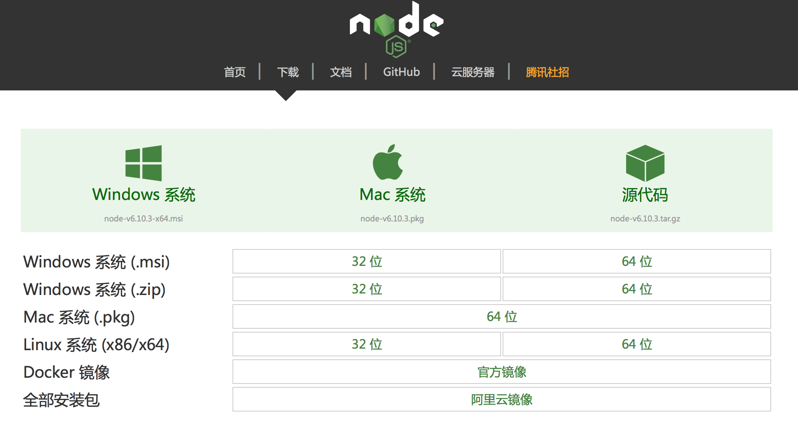
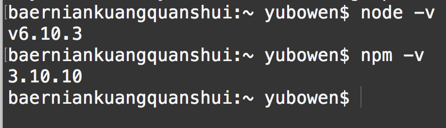
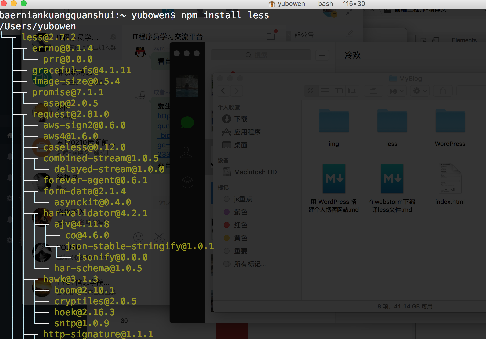
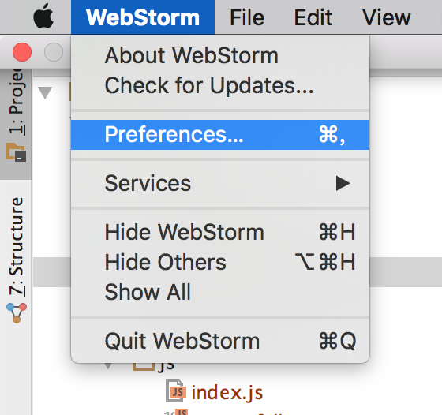
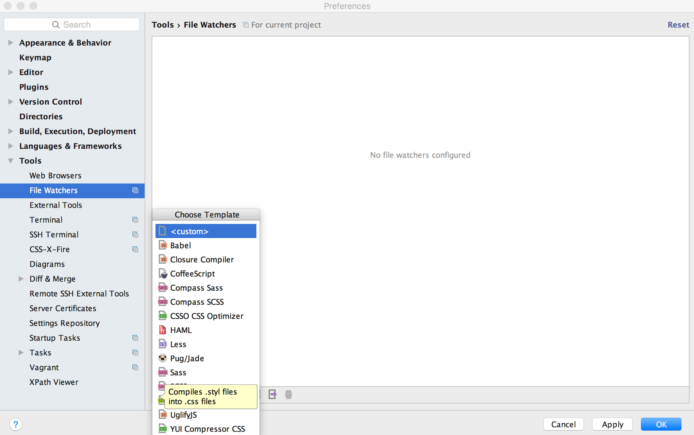
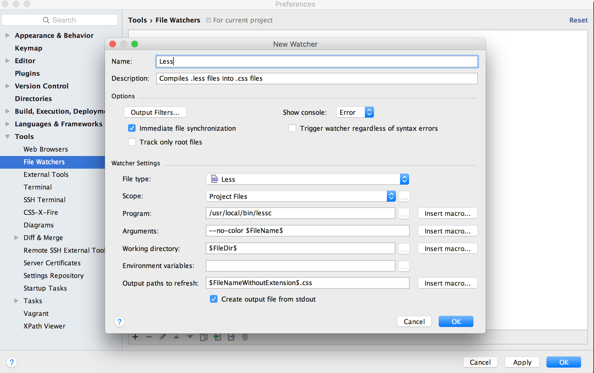

# 在webstorm下编译less文件

## 第一步，准备阶段 —— 安装less

编译 **less** 需要 **node** 环境，为了前端开发，我觉得这个是必须要装的，所以还是装一下 [node.js](http://nodejs.cn/download/)，下载对应电脑版本的就好



分别输入

```javascript
node -v

npm -v
```

看到以下这样



接下来就可以安装 less 了，在npm下安装   ，输入以下代码


```javascript
npm install less
```

然后就看到这么一大坨的东西



### 到此为止，我们的less就安装完成了

## 第二步，配置webstorm

1. 首先打开 preferences （windows应该是设置选项吧）
2. 找到 **tools** 下面有个 **file watches**
3. 点击下面的加号来增加一个 **less** 配置
4. 然后填入相关信息点击ok就好了





- 接下来在新建文件的时候，选择新建less文件，就可以自动生成一个相同名字的css文件了，在页面引入该css文件就可以了