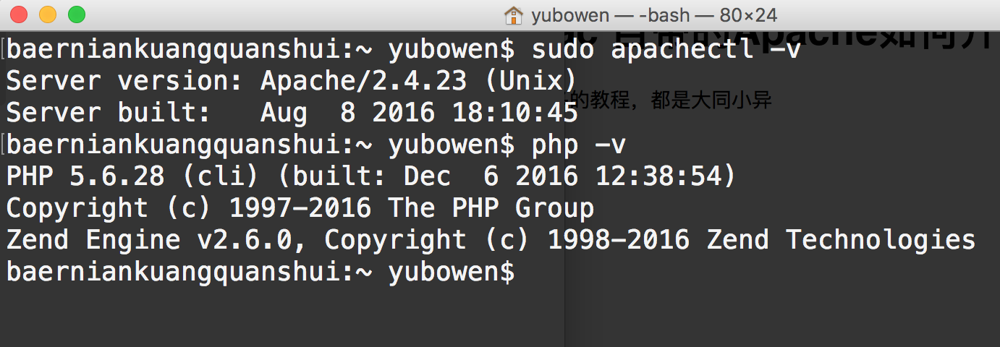

# Mac 端用 WordPress 搭建个人博客网站

## 1.查看本机 Mac 的 Apache 和 PHP版本

在终端输入 `sudo apachectl -v` 和 `php -v` 可以看到本机的Apache和php的版本，如下图 

## 2.配置 MySQL 数据库

由于mac自身是不带数据库的，为了和 Apache 和 PHP 配合使用，首先我们要去 oracle 官网去下载最新的 MySQL 数据库 链接(http://www.baidu.com)

我这里有已经下载完成的 dmg 文件供大家下载

- 下载完成后安装就不用说了吧，下一步下一步的就好了，最后如下图

 

点击 ok 然后结束安装，之后在 系统偏好设置，在最下面可以找到有个 MySQL 的按钮，如下图

 

点开之后如下图所示，然后点击 start MySQL server 来启动数据库

 

## 3.安装 WordPress

上面的步骤全部完成之后就开始在本机布置 WordPress 了

- 首先去官网下载最新的 WordPress 文件 *链接地址*
- 然后放到本机的服务器的目录下面（我在前面写过如何开启 Mac 本机的服务器）
- 在服务器中打开 WordPress 的文件夹，可以看到如下的欢迎页

  

- 点击开始，开始进行 WordPress 和数据库的关联